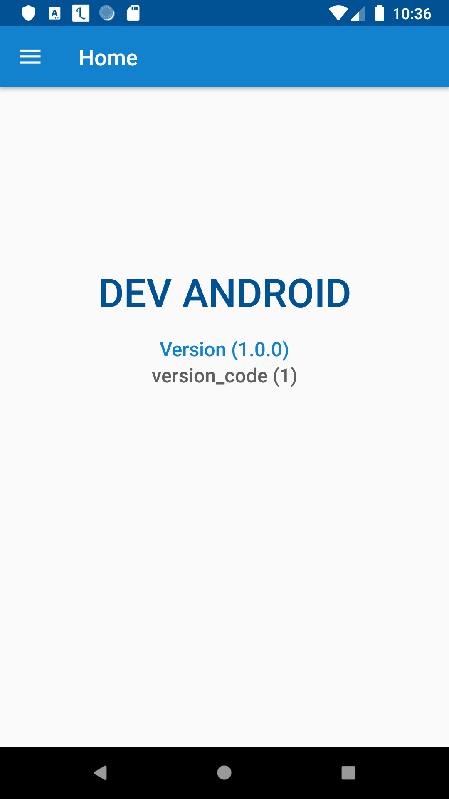
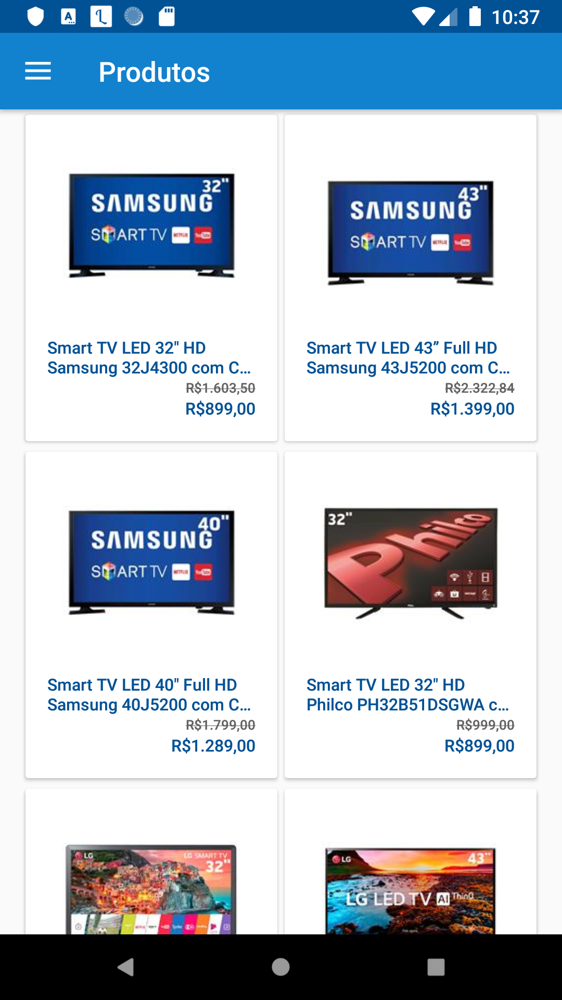
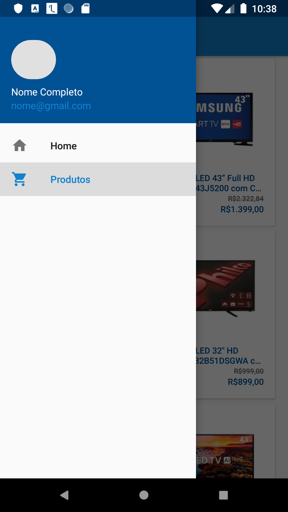

## Desafio Via Varejo

Aplicativo criado para avaliação Via Varejo, este aplicativo contém a as seguintes telas: 

- Home;
- Listagem de produtos;
- Detalhe do produto.

##### Requisitos para rodar a aplicação 
Estes requisitos devem ser atendidos devido a estratégia de gerenciamento de dependências.

- Android Studio 3.5 ou superior
- Gradle 5.4.1
- Emulador ou dispostivo rodando Android API level 21 ou superior

##### Resultado 
A linha de raciocinio seguida para completar a aplicação foi sempre procurar definir a responsabilidade de cada item e isolar a regra de negócio para uma fácil manutenção e compreensão do código, o maior desáfio foi realizar testes de forma eficiente, o período total de desenvolvimento foi de aproximadamente 12h começando dem 07/01/2020 as 10h00 e finalizando 07/01/2020 as 21h30.

###### Prints

